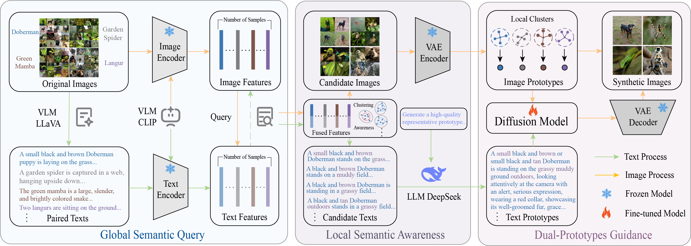
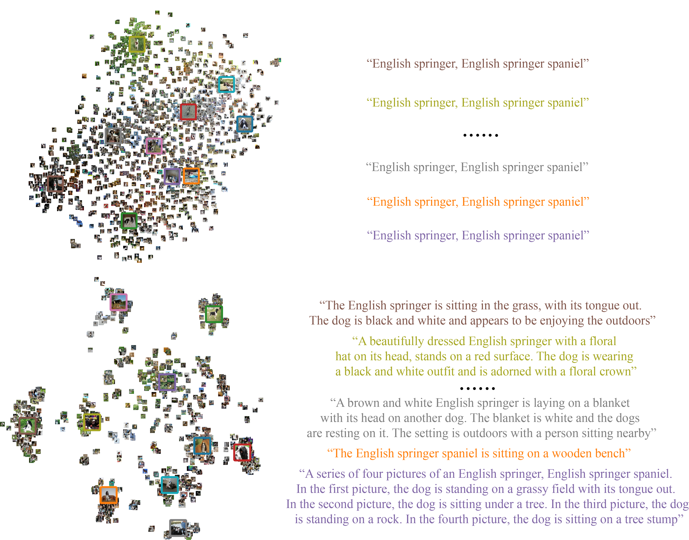

# 📄 EDITS: Enhancing Dataset Distillation with Implicit Textual Semantics [**[arxiv](https://arxiv.org)**] [**[appendix](https://)**]  
## 🔥 Motivation

Traditional learned image prototypes tend to focus on low-level visual textures such as background and illumination, failing to adequately leverage the implicit textual semantic inherent in images. This results in suboptimal prototypes and ultimately leads to performance degradation. (Top) The uniform grassy background diminishes the salience of the beagle's posture. (Bottom) The light intensity affects the state expression of the played French horn.


## 📖 Introduction

Dataset distillation aims to synthesize a compact dataset from the original large-scale one, enabling highly efficient learning while preserving competitive model performance. However, traditional techniques primarily capture low-level visual features, neglecting the high-level semantic and structural information inherent in images. In this paper, we propose **EDITS**, a novel framework that exploits the implicit textual semantics within the image data to achieve enhanced distillation. First, external texts generated by a Vision Language Model (VLM) are fused with image features through a Global Semantic Query module, forming the prior clustered buffer. Local Semantic Awareness then selects representative samples from the buffer to construct image and text prototypes, with the latter produced by guiding a Large Language Model (LLM) with meticulously crafted prompt. Ultimately, Dual Prototype Guidance strategy generates the final synthetic dataset through a diffusion model. Extensive experiments confirm the effectiveness of our method.



## 🚀 Quick Start

### Create environment
```sh
# Requirements
Python >= 3.12.4
PyTorch >= 2.3.1
Torchvision >= 0.18.1
diffusers >= 0.30.0.dev0
llava >= 1.2.2.post1
```
#### Generate text via LLava
You can install or upgrade the latest version of [LLava GitHub Repository](https://github.com/haotian-liu/LLaVA).
```sh
#Generate configure for llava
python text_generation/config_produce_llava.py
# Run llava (Generate the paired text)
python LLaVA/llava/eval/model_vqa.py  --model-path liuhaotian/llava-v1.5-7b --question-file data/output.json  --image-folder    ImageWoof/train   --answers-file  data/answer-file-our.jsonl
#Arrange the file format
python text_generation/llava_result_sum.py
```
### Diffusion model training
You can install or upgrade the latest version of [Diffusers library](https://github.com/huggingface/diffusers/tree/main).

#### Train Diffusion model via image and text
You can train diffusion model follow the code below or you can use the model trained by us.
```sh
sh train_diffusion.sh
```

### Generate Prototypes

```sh
# ours
sh gen_prototype_ours.sh

# vlcp
sh gen_prototype_vlcp.sh
```

### Synthesis Images
```sh
# ours
sh gen_syn_images_ours.sh

# vlcp
sh gen_syn_images_vlcp.sh
```

### Validate
```sh
cd evaluation/Minimax

# ours
sh train_ours.sh

# vlcp
sh train_vlcp.sh
```
## Results
Visualation of Prototypes.<br>
<br>

## Acknowledgments
Our code is developed based on the following codebases, thanks for sharing！<br>

[Dataset Distillation via Vision-Language Category Prototype](https://github.com/zou-yawen/Dataset-Distillation-via-Vision-Language-Category-Prototype/)<br>
[D4M: Dataset Distillation via Disentangled Diffusion Model](https://github.com/suduo94/D4M?tab=readme-ov-file#-acknowledgments)<br>
[Efficient Dataset Distillation via Minimax Diffusion](https://github.com/vimar-gu/MinimaxDiffusion)<br>
[On the Diversity and Realism of Distilled Dataset: An Efficient Dataset Distillation Paradigm](https://github.com/LINs-lab/RDED)

## Citation
If you find this work useful, please consider citing:

```bibtex

